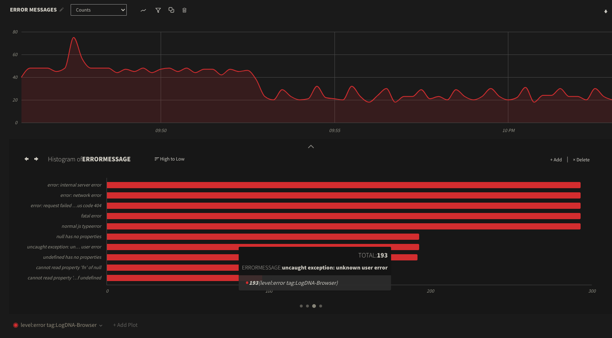

# @logdna/browser

[](#)


A code library for implementing frontend browser logging and exception capturing in LogDNA. Capture browser errors and log messages from your console and centralize them to your LogDNA instance. Optionally, use the [LogDNA Browser Logger Template](https://docs.mezmo.com/page/logdna-browser-logger-template) to get out-of-the-box Views, Boards, and Screens to analyze your browser logs.

- [Module Installation](#module-installation)
- [Example Usage](#example-usage)
- [Enable CORS in LogDNA](#enable-cors-in-logdna)
- [Browser Logger Template](#browser-logger-template)
- [Send log lines to LogDNA](#send-log-lines-to-logdna)
- [Add custom meta data for log lines](#add-custom-metadata-for-log-lines)
- [Session ID](#session-id)
- [Configuration options](#configuration-options)
  - [`sampleRate` option](#samplerate-option)
  - [Buffer](#buffer)
  - [Hooks](#hooks-option)
- [Unloading websites](#unloading-websites)
- [Plugins (Experimental)](#plugins-experimental)
- [Debug helpers](#debug-helpers)
- [Project Examples](#project-examples)
  - [React Example](#react-example)
  - [HTML Example](#html-example)

## Module Installation

Browser Logger is in Beta - API will evolve as we continue to develop and refine new features.

Using NPM:

```
npm install @logdna/browser
```

Using Yarn:

```
yarn add @logdna/browser
```

## Example Usage

> :warning: **Before logs can be sent to LogDNA you must add your web application URL to your [LogDNA account CORS configuration](#enable-cors-in-logdna).**

```js
import logdna from '@logdna/browser';

// Found in Settings > Organization > API Keys
const LOGDNA_INGESTION_KEY = 'xxxxxxxxxxxxxxxxxxxxxxxxxxxxxxxx';

logdna.init(LOGDNA_INGESTION_KEY);
logdna.addContext({
  // Context is appended to the metadata of each message sent to LogDNA
  // Add any custom meta data such as:
  version: 'v1.0.2',
  sessionReplay: 'http://mySessionReplayTool/',
  env: 'prod',
  user: {
    email: 'user@email.email',
    userId: '987654321',
  },
});

logdna.log('Hello world!');

// By default captures console messages (see `console` options below).
console.log('Hello world!');
```

## Enable CORS in LogDNA

> :warning: **Before logs can be sent to LogDNA you must add your web application URL to your LogDNA account CORS configuration.**

- Login to LogDNA
- Go to Settings
- Click on Organizations
- Click on [Whitelist Domains](https://app.mezmo.com/manage/whitelist-domains)
  - Add your web application's full URL, including the https and any port information
  - _Note: This may take around 15 minutes before the domain is properly whitelisted._
  - ex: `https://www.YourAppAddressHere.com`
  - ex: `http://localhost:3000`

## Browser Logger Template

Use the [LogDNA Browser Logger Template](https://docs.mezmo.com/page/logdna-browser-logger-template) to get out-of-the-box Views, Boards, and Screens to analyze your errors and log messages from Browser Logger.

**Example Board included in the Template:**



## Send log lines to LogDNA

There are two ways to send log lines to LogDNA:

1. Using the `console.[log, error, warn, debug, info]` with the configuration option `console: true` will send console messages to LogDNA and also to the browser's devtools console
2. Using one of the following methods will just send the log message to LogDNA without sending the information to the console The log parameter message can be of any type.

```js
import logdna from '@logdna/browser';

logdna.log('My log message');

logdna.error('My error message');

logdna.debug('My debug message');

logdna.info('My info message');

logdna.warn('My warn message');
```

Each method accepts an additional `lineContext` parameter to add additional metadata to the `meta` log field in LogDNA

Example:

```js
logdna.log('My log message', {
  thing: 'Extra Metadata',
});
```

## Add custom metadata for log lines

Use the `logdna.addContext({ })` method any time after initialization to add any custom metadata to each log line. This is useful to send application version information, logged-in user or account information, links to additional tools such as session replays, and just about anything else that you want associated with each log line.

```js
logdna.addContext({
  // Add any custom metadata such as:
  version: 'v1.0.2',
  sessionReplay: 'http://mySessionReplayTool/',
  user: {
    email: 'user@email.email',
  },
});
```

LogDNA's Browser Logger will automatically add the user's browser information and the `window.location` object to the log line.

Example of automatically added context:

```json
"sessionId": "d1b69ea3-41c4-4b9b-85e2-32fb94cb219c",
"browser": {
  "name": "chrome",
  "version": "87.0.4280",
  "os": "Mac OS",
  "type": "browser"
},
"location": {
  "ancestorOrigins": {},
  "href": "https://your-web-app/home?q=1234567890",
  "origin": "https://your-web-app",
  "protocol": "https:",
  "host": "your-web-app",
  "hostname": "your-web-app",
  "port": "",
  "pathname": "/home",
  "search": "?q=1234567890",
  "hash": ""
},
```

## Session ID

When LogDNA's Browser Logger is initialized it will generate a unique uuid v4 sessionId. This sessionId will make it easy to follow a particular user/session within the LogDNA console.

### Defining a Custom Session ID

You can set a custom session `sessionId` by calling `logdna.setSessionId('your-custom-id')`. Log lines sent before setting a custom session ID may contain the previous auto generated session ID.

## Configuration Options

Example Configuration:

```js
logdna.init(LOGDNA_INGESTION_KEY, {
  app: 'my-app',
  console: {
    integrations: ['error', 'warn'],
  },
  sampleRate: 5,
});
```

| options                                               | default value                               | type               | description                                                                                                                                                             |
| ----------------------------------------------------- | ------------------------------------------- | ------------------ | ----------------------------------------------------------------------------------------------------------------------------------------------------------------------- |
| `app`                                                 | `window.location.hostname`                  | string             | Name of your application                                                                                                                                                |
| `hostname`                                            | logdna-browser-logger                       | string             | A hostname associated with each log line, populates the Source field in the LogDNA UI.                                                                                  |
| `tags`                                                | 'LogDNA-Browser'                            | string or string[] | Add custom tags used in the LogDNA log line interface. Will always contain `LogDNA-Browser`.                                                                            |
| `enableStacktrace`                                    | `true`                                      | boolean            | Enable adding stack traces for each log message (does not affect error stack traces)                                                                                    |
| `console`                                             | `true`                                      | boolean or object  | Enable sending console message to LogDNA for all supported methods or an options object                                                                                 |
| `console.enable`                                      | `false`                                     | boolean            | Enable sending console message to LogDNA                                                                                                                                |
| `console.integrations`                                | `['log', 'info', 'debug', 'warn', 'error']` | array              | Console methods to override for sending logs to LogDNA and to the console                                                                                               |
| `globalErrorHandlers`                                 | `true`                                      | boolean or object  | Enable adding a global error handler and unhandledPromiseRejection handler to forward to LogDNA                                                                         |
| `globalErrorHandlers.enableErrorHandler`              | `false`                                     | boolean            | Enable automatic capturing and logging of unhandled errors.                                                                                                             |
| `globalErrorHandlers.enableUnhandledPromiseRejection` | `false`                                     | boolean            | Enable automatic capturing and logging of unhandled promised rejections.                                                                                                |
| `sampleRate`                                          | 100                                         | number             | Percentage of sessions to track from 0 to 100. `0` for none `100` for all                                                                                               |
| `url`                                                 | https://logs.mezmo.com/logs/ingest          | string             | Mezmo ingestion URL                                                                                                                                                     |
| `flushInterval`                                       | 250                                         | number             | Number of milliseconds to buffer log lines before sending to LogDNA                                                                                                     |
| `disabled`                                            | `false`                                     | boolean            | Disable the logger from sending logs                                                                                                                                    |
| `debug`                                               | `false`                                     | boolean            | When debug is `true`, `logdna.<log, error, warn, info, debug>` methods will log to both LogDNA and to the console. When `false` these methods will only send to LogDNA. |
| `hooks`                                               | `{ }`                                       | object             | Add function to manipulate log message. [See hooks.](#hooks-option)                                                                                                     |

## `sampleRate` option

You can decrease the percentages of sessions that send logs to LogDNA by specifying the `sampleRate` option. The `sampleRate` should be a number `0` to `100` which represents the percentage of sessions that you want to send logs to LogDNA. `0` mean no sessions will send logs, `100` (the default) means every session will have logs sent. `5` for example, means that just 5 percent of the client instances initialized will send logs.

## `hooks` options

### `beforeSend`

The beforeSend hook allow for you to manipulate log message, add line context and evaluate the log level before the message is sent to LogDNA. The beforeSend function will receive a single parameter object containing `{ message, level, lineContext }`.

Example:

To filter message for Social Security Numbers you an add hook the following hook to your options object

```javascript
logdna.init('ingestionkey', {
  hooks: {
    beforeSend: [
      ({ message, level, lineContext }) => {
        if (typeof message === 'string') {
          message = message.replace(/\d{3}-\d{2}-\d{4}/g, 'XXX-XX-XXXX');
        }
        return { message, level, lineContext };
      },
    ],
  },
});
```

Notes:

- Make sure the return the object in the same form as the function parameter.
- Returning `null` will stop all other hooks of the same type from running. It will also stop the message from being sent to LogDNA.
- Since the message can be of any type make sure to validate the type before running methods on it.
- Hooks are evaluated in the order they are added to the hook array.

## Buffer

LogDNA's Browser Logger will buffer log message going to LogDNA, the default buffer time is `250ms` and is customizable via the `flushInterval` configuration option.

## Unloading websites

The LogDNA Browser Logger will attempt to flush the logs before the page unloads. This is done via the [keepalive](https://developer.mozilla.org/en-US/docs/Web/API/WindowOrWorkerGlobalScope/fetch#:~:text=keepalive) `fetch` requests flag. There is a 64kb internal `fetch` quota limit for **keep-alive** requests. Any request over that will result in a `network error` message as per the `fetch` spec.

## Failures

If there are failures when sending log lines to LogDNA the logger will attempt to retry sending the logs up to 30 times.

## Debug helpers

The LogDNA Browser Logger exposes several helpers methods off the `window.__LogDNA__` namespace.

Show the current configuration

```js
___LogDNA__.showConfig();
```

Show the current context

```js
___LogDNA__.showContext();
```

## NextJS and Server Side Rendering

When using a Server Side Rendering framework such as NextJS you will need to delay the initialization of the LogDNA Browser logger until `window` is present. Here is an example on how to do that.

```javascript
logdna.init('<LOGDNA_INGESTION_KEY>', {
  disabled: typeof window === 'undefined',
});
```

or if using Next.js with React hooks you can `useEffect`

```javascript
useEffect(() => {
  logdna.init();
}, []);
```

## Electron

To allow the LogDNA Browser logger to run in an Electron app you must run your application on a custom protocol. This so we can enable whitelisting with in the LogDNA interface for CORS requests.

In your background Electron javascript file add

```javascript
import { app, protocol, BrowserWindow } from 'electron';
import { createProtocol } from 'vue-cli-plugin-electron-builder/lib';

// Scheme must be registered before the app is ready
protocol.registerSchemesAsPrivileged([{ scheme: 'app', privileges: { secure: true, standard: true } }]);

async function createWindow() {
  // Create the browser window.
  const win = new BrowserWindow({
    width: 800,
    height: 600,
    webPreferences: {
      nodeIntegration: process.env.ELECTRON_NODE_INTEGRATION,
      contextIsolation: !process.env.ELECTRON_NODE_INTEGRATION,
    },
  });

  if (process.env.WEBPACK_DEV_SERVER_URL) {
    // Load the url of the dev server if in development mode
    await win.loadURL(process.env.WEBPACK_DEV_SERVER_URL);
    if (!process.env.IS_TEST) win.webContents.openDevTools();
  } else {
    // This will register a app://. url for CORS
    createProtocol('app');
    // Load the index.html when not in development
    win.loadURL('app://./index.html');
  }
}
```

The important parts for in this example are the `protocol.registerSchemesAsPrivileged` and the `else` block to register the protocol called `app` and to load the `index.html`

Now in the LogDNA application add a whitelisted URL for `app://.`

# Project Examples

Project examples can be found under `/examples`.

## React Example

```sh
npm link
cd examples/react-example
npm install
npm link "@logdna/browser"
REACT_APP_LOGDNA_INGEST_KEY="<YOUR_KEY_HERE>" npm start
```

Visit http://localhost:3000

## HTML Example

```sh
npm run build
npm run serve # Starts up static server for build on localhost:5000
cd examples/html-example
npm install
npm start
```

Visit http://localhost:1234

_Happy Logging!_
